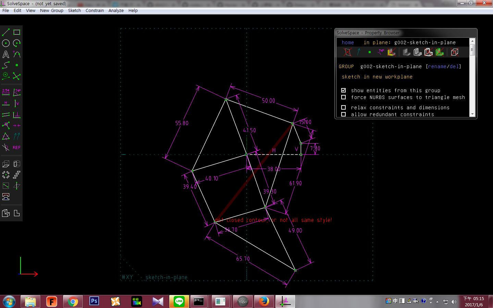
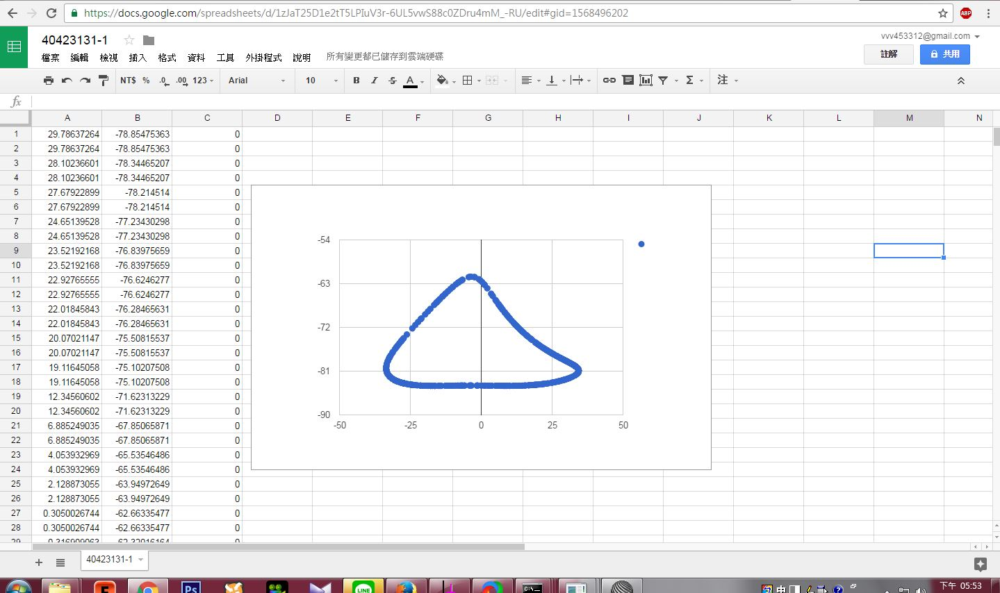

Title: 40423131 W18 電腦輔助設計實習課程總結
Date: 2017-01/12 12:08
Category:HW
Tags: 作業
Author: 40423131   

40423131 W18作業
<!-- PELICAN_END_SUMMARY -->

#### 個人操作影片圖片

###W13 【Solvespace】四連桿與多連桿運動模擬
<iframe src="https://player.vimeo.com/video/198318410" width="640" height="363" frameborder="0" webkitallowfullscreen mozallowfullscreen allowfullscreen></iframe>

<a href="https://vimeo.com/198318410">Solvespace 平面四連桿機構模擬</a> from <a href="https://vimeo.com/user44207151">40423131</a> on <a href="https://vimeo.com">Vimeo</a>.

Solvespace方塊 組合圖

<iframe src="./../31/01.html" width="400" height="300"></iframe>

###W14 【Solvespace】3D列印機組裝影片
<iframe src="https://player.vimeo.com/video/198314415" width="640" height="342" frameborder="0" webkitallowfullscreen mozallowfullscreen allowfullscreen></iframe>

<a href="https://vimeo.com/198314415">示範 用Solvespace3D列印機組裝</a> from <a href="https://vimeo.com/user44207151">40423131</a> on <a href="https://vimeo.com">Vimeo</a>.

底盤

<iframe src="./../31/3D/20161217-5.html" width="400" height="300"></iframe>

連接桿

<iframe src="./../31/3D/20161217.html" width="400" height="300"></iframe>

支柱

<iframe src="./../31/3D/20161217-1.html" width="400" height="300"></iframe>

圓盤

<iframe src="./../31/3D/20161217-3.html" width="400" height="300"></iframe>

自製3D列印機

<iframe src="./../31/3D/20161217-2.html" width="400" height="300"></iframe>
<iframe src="./../31/3D/exp.html" width="400" height="300"></iframe>

###W15 【onshap】組裝3D列印機
連結網址:<a href="https://40423131.github.io/2016fallcadp_hw/blog/40423131-w15-zu-zhuang-3dlie-yin-ji.html">W15週</a>

###W16 【onshap】用3D onshap畫零件 

<iframe src="https://player.vimeo.com/video/198177329" width="640" height="353" frameborder="0" webkitallowfullscreen mozallowfullscreen allowfullscreen></iframe>

<a href="https://vimeo.com/198177329">40423131 12/27 onshape 示範畫零件</a> from <a href="https://vimeo.com/user44207151">40423131</a> on <a href="https://vimeo.com">Vimeo</a>.

###W17 【onshap】用3D onshape組裝零件

## onshape組裝1 
<iframe src="https://player.vimeo.com/video/198165707" width="640" height="415" frameborder="0" webkitallowfullscreen mozallowfullscreen allowfullscreen></iframe>

<a href="https://vimeo.com/198165707">40423131 1/5 onshape 連桿組裝影片1</a> from <a href="https://vimeo.com/user44207151">40423131</a> on <a href="https://vimeo.com">Vimeo</a>.

## onshape組裝2
<iframe src="https://player.vimeo.com/video/198165700" width="640" height="415" frameborder="0" webkitallowfullscreen mozallowfullscreen allowfullscreen></iframe>

<a href="https://vimeo.com/198165700">40423131 1/5 onshape 連桿組裝影片2</a> from <a href="https://vimeo.com/user44207151">40423131</a> on <a href="https://vimeo.com">Vimeo</a>.

